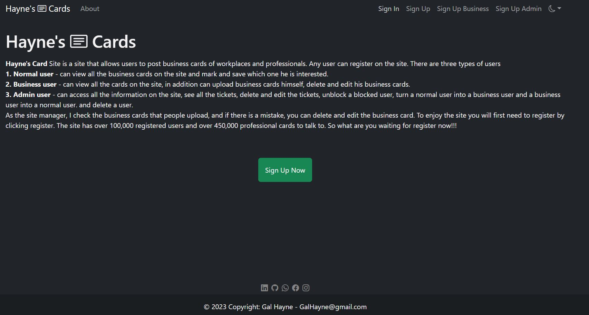

# Hayne's Cards
> Creating an accessible React application, including backend and frontend for managing business cards

## Creating a new project

>First you will open a new folder from which you want to run the project
>
>Enter to visual code to the folder that you created before
>
>Open terminal and use git clone command:

```sh
git clone https://github.com/GalHayne/HackerUReactProject.git
cd .\HackerUReactProject\
```

>Open 2 terminals one for the front and the other for the server
```sh
cd .\real-app-front\
cd .\real-app-server\
```

> You need install all framework use `npm i --force` inside real-app-fron and inside real-app-server
```sh
npm i --force 
```

> Note that you must have mongoDB on your computer:
[MongoDB installation](https://tomchentw.github.io/react-google-maps/#installation)

## Run The Project
> In first terminal (real-app-front) write npm run start
 ```sh
npm run start
```

> In other terminal (real-app-server) write npm run dev
 ```sh
npm run dev
```

## Starting work
> After the installation is successful, the site opens on the main screen of the site

